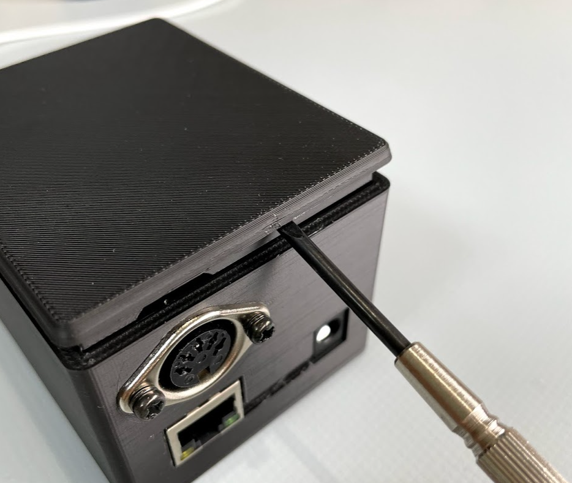
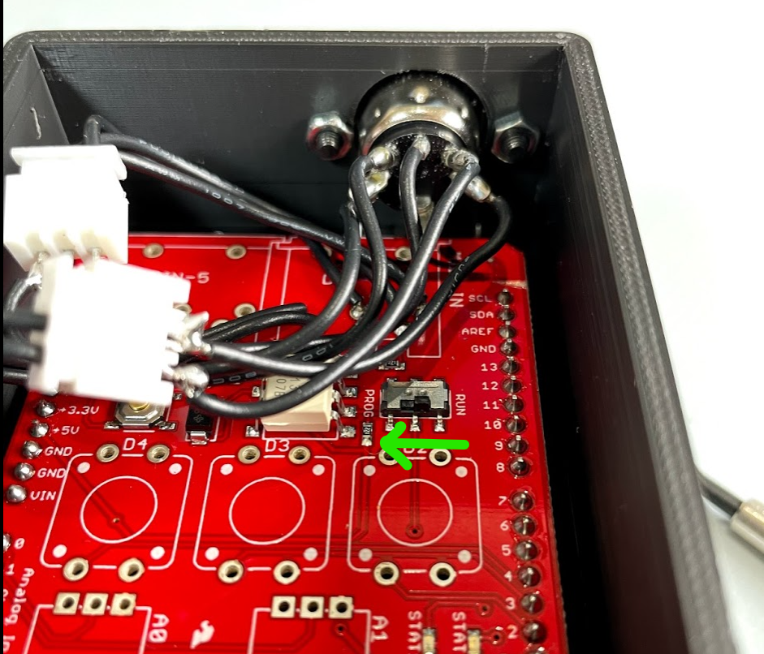

# MIDINetworkTool

### 概要
#### MIDI送信プロトコル
* MIDIで受けた情報をOSCでスルーします。以下主なアドレス。ArgumentはすべてInt
* KaossPadから流れてくるのは概ねこのあたりですが、ほかの信号も一応受けたら出すようになっています。

| Address | Argument                   |
| -------- | -------------------------- |
| /noteOn  | Channel, Note, Velocity    |
| /noteOff | Channel, Note, Velocity    |
| /pitch   | Channel, Value             | 
| /cc      | Channel, Controller, Value |
| /clock   | ticks                      |

### 初期設定
* 初期のネットワーク情報。

| 項目               | 値                |
| ------------------ | ----------------- |
| デバイスIPアドレス | 192.168.1.201     |
| 送信先IPアドレス   | 192.168.1.101     |
| 送信ポート番号     | 12500             |
| 受信ポート番号     | 12400             |
| MACアドレス        | C0:FF:EE:01:C0:1C | 

### ユーティリティ
#### OSCによる設定の書き換え
* MACアドレス以外の設定項目は、OSC経由で書き換え可能です。
* 変更メッセージを送った後、起動しなおすとその項目でネットワークが立ち上がります。
* 設定はEEPROMに保存するようにしてあるので、以後その設定は保存されます。
* 設定が受信されると、/debugというアドレスで変更結果を返信します。

| 設定項目           | Address    | Argument                      |
| ------------------ | ---------- | ----------------------------- |
| デバイスIPアドレス | /client    | IP4バイト(int, int, int, int) |
| 送信先IPアドレス   | /host      | IP4バイト(int, int, int, int) |
| 送信ポート番号     | /port/send | ポート番号(int)               |
| 受信ポート番号     | /port/recv | ポート番号(int)               |

#### 設定のリセット・プログラムの書き換え
* 上記の通りOSCで設定変更できますが、この方法だとデバイスIPか受信ポート番号が分からなくなると設定が変更できなくなります。
* その場合はプログラムを再度書き直すことで設定を上書きできます。

#### 書き換え手順
1. 20行目辺りから始まる設定項目の変数を、設定したい値に変更する
2. boolのfactoryResetをtrueに変更
3. マイナスドライバー等で蓋を開けて、シールドのスイッチを「PROG」に変更(書き込みモード)

4. ArduinoIDEで書き込み
5. 設定した項目で動作しているか確認
6. **factoryResetを今度は"false"に変更して再度書き込み**（これをしないと毎度EEPROMが初期化されるので、OSCによる変更が適用されなくなるのと、ROM書き換え寿命が縮まってしまいます）
7. シールドのスイッチを「RUN」に戻す
8. 蓋を閉じて完了